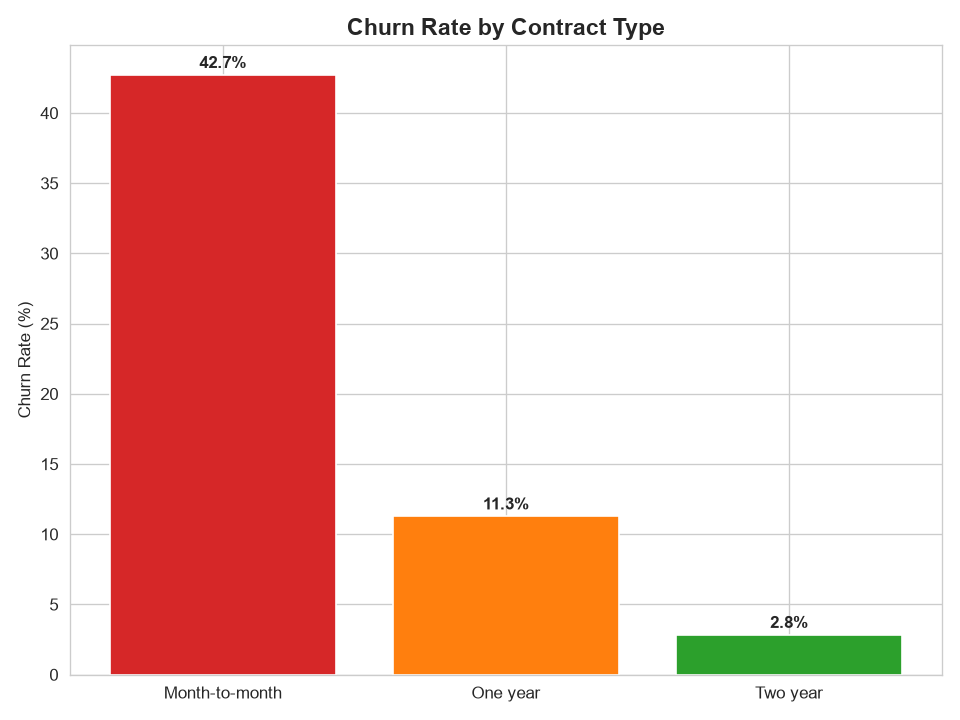
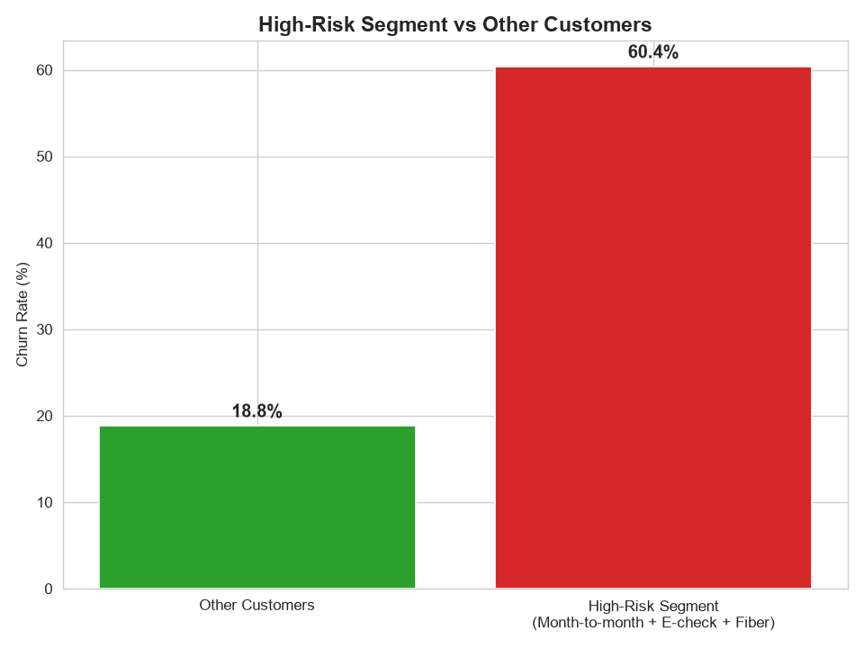

# 📊 Telco Customer Churn Analysis

<p align="center">
  <b>End-to-End Customer Churn Analytics with SQL, Python, Power BI & AI</b>
</p>

<p align="center">
  
  
  
  
  
</p>

---

## 📌 Overview

An end-to-end **customer churn analytics project** built using the IBM Telco Customer Churn dataset.

The project combines:

* 🐍 **Python** for data cleaning, EDA and visualization
* 🗄️ **SQL** for segmentation and KPI analysis
* 🤖 **Google Gemini** for an AI-powered natural-language Data Analyst Agent
* 📊 **Power BI** for interactive business intelligence and dashboarding

The objective is to identify **which customers are most likely to churn, why they churn, and which customer segments represent the greatest retention and revenue risk.**

---

## 🎯 Business Question

> **Which customers are most likely to churn, and what combination of factors puts them at the highest risk?**

The analysis focuses on:

* Contract type
* Payment method
* Internet service
* Customer tenure
* Monthly charges
* Customer lifetime value
* Compound customer segments

---

## 📈 Key Results

| KPI                       |     Result |
| ------------------------- | ---------: |
| 👥 Total Customers        |  **7,043** |
| 🔴 Overall Churn Rate     | **26.54%** |
| 🚪 Churned Customers      |  **1,869** |
| 📄 Month-to-Month Churn   | **42.71%** |
| 💳 Electronic Check Churn | **45.29%** |
| ⏳ New Customer Churn      | **47.68%** |
| 🏆 Highest-Risk Segment   | **60.37%** |

---

## 🔥 Key Insights

### 1. Contract Type Is the Strongest Churn Indicator

| Contract       | Churn Rate |
| -------------- | ---------: |
| Month-to-month | **42.71%** |
| One year       | **11.27%** |
| Two year       |  **2.83%** |

Customers without a long-term commitment show dramatically higher churn.

---

### 2. High-Risk Customer Segment

The analysis identified a particularly vulnerable customer segment:

> **Month-to-month + Electronic Check + Fiber Optic**

**Churn Rate: 60.37%**

This is more than **2× the overall churn rate**, making this segment a strong candidate for targeted retention campaigns.

---

### 3. Payment Method Matters

Customers using **Electronic Check** show a churn rate of:

> **45.29%**

Compared with approximately **15–19%** for other payment methods.

This makes payment method an important dimension for further customer segmentation and investigation.

---

### 4. Tenure Strongly Correlates With Retention

| Customer Tenure | Churn Rate |
| --------------- | ---------: |
| 0–12 months     | **47.68%** |
| 49–72 months    |  **9.51%** |

New customers are significantly more likely to churn than long-tenured customers.

---

## 💰 Revenue Impact

Month-to-month churned customers represent approximately:

**$120,847**

in monthly recurring revenue at risk.

Estimated lost customer value:

**$1.93M**

This demonstrates that churn is not only a customer-retention problem — it is a measurable **revenue-risk problem**.

---

# 🤖 AI Data Analyst Agent

The project includes an **AI-powered Data Analyst Agent** that allows users to query the churn dataset using natural language.

### Example

**Question**

```text
Which contract type has the highest churn rate?
```

### Agent Workflow

```text
Natural Language Question
          ↓
     Google Gemini
          ↓
   Generate Pandas Code
          ↓
 Execute Against Dataset
          ↓
      Raw Result
          ↓
 Natural Language Answer
```

### Example Generated Analysis

```python
result = (
    (df['Churn'] == 'Yes')
    .groupby(df['Contract'])
    .mean()
    .idxmax()
)
```

### Result

```text
Month-to-month
```

The agent therefore acts as a **natural-language Data Analyst**, allowing business questions to be answered without manually writing the underlying analysis code.

---

# 🔄 Project Workflow

```text
              IBM Telco Dataset
                      │
                      ▼
               Data Cleaning
                      │
                      ▼
             Exploratory Analysis
                      │
          ┌───────────┴───────────┐
          ▼                       ▼
       Python                    SQL
          │                       │
          │              Customer Segmentation
          │                       │
          └───────────┬───────────┘
                      ▼
                Key Findings
                      │
             ┌────────┴────────┐
             ▼                 ▼
        AI Data Agent       Power BI
             │              Dashboard
             └────────┬────────┘
                      ▼
             Business Insights
                      │
                      ▼
             Retention Strategy
```

---

# 🛠️ Tech Stack

### Data Analysis

* Python
* Pandas
* Matplotlib
* Seaborn

### Database & SQL

* SQLite
* CTEs
* `CASE WHEN`
* Aggregations
* Segmentation queries

### Generative AI

* Google Gemini API
* Natural-language querying
* Code generation
* AI-assisted data analysis

### Business Intelligence

* Microsoft Power BI
* DAX
* Calculated columns
* Interactive dashboards

---

# 📁 Project Structure

```text
telco-customer-churn-analysis/
│
├── 01_load_data.py
├── 02_clean_data.py
├── 03_eda.py
├── 04_ai_agent.py
├── 05_load_to_sqlite.py
├── 06_sql_queries.py
├── 07_visualizations.py
│
├── telco_churn_clean.csv
├── Telco_Churn_Dashboard.pbix
│
├── chart1_churn_by_contract.png
├── chart4_high_risk_segment.png
│
└── README.md
```

---

# 🗄️ SQL Analysis

SQL was used to perform reproducible customer segmentation and KPI calculations.

Example:

```sql
SELECT
    Contract,
    AVG(
        CASE
            WHEN Churn = 'Yes' THEN 1.0
            ELSE 0.0
        END
    ) AS churn_rate
FROM customers
GROUP BY Contract
ORDER BY churn_rate DESC;
```

The SQL analysis was also used to identify compound high-risk customer segments.

---

# 📊 Power BI Dashboard

The Power BI dashboard provides an interactive view of churn across major customer segments.

### Dashboard includes

* Churn KPIs
* Churn by contract
* Churn by payment method
* Churn by internet service
* Tenure-based analysis
* High-risk segment analysis
* Customer and revenue insights

### Dashboard Preview

<p align="center">
  
</p>

<p align="center">
  
</p>

---

# 💡 Business Recommendations

### 🎯 1. Target Month-to-Month Customers

Offer incentives for high-risk customers to transition toward longer-term contracts.

### 🚀 2. Focus on Early-Tenure Customers

Strengthen onboarding and engagement programs during the first 12 months.

### 🔥 3. Prioritize High-Risk Segments

Use the identified compound segment for targeted retention campaigns.

### 💳 4. Investigate Electronic Check Customers

Analyze whether payment experience or billing friction contributes to the unusually high churn rate.

### 💰 5. Combine Churn Risk With Customer Value

Prioritize retention efforts toward customers with both:

```text
High Churn Risk
        +
High Customer Value
```

---

# 📚 What This Project Demonstrates

This project demonstrates an end-to-end analytics workflow:

```text
Raw Data
   ↓
Data Cleaning
   ↓
EDA
   ↓
SQL Analysis
   ↓
Customer Segmentation
   ↓
AI-Assisted Analysis
   ↓
Power BI Dashboard
   ↓
Business Recommendations
```

### Core Skills

**Data Analytics**

* Data cleaning
* Exploratory analysis
* Customer segmentation
* KPI analysis
* Business insights

**SQL**

* Aggregations
* CTEs
* Conditional logic
* Segmentation
* Churn analysis

**Python**

* Pandas
* Data transformation
* Visualization
* Exploratory analysis

**Power BI**

* DAX
* Calculated columns
* Dashboard design
* Interactive visualization

**Generative AI**

* Natural-language data querying
* LLM-powered code generation
* AI-assisted analytical workflows

---

## 📌 Dataset

This project uses the **IBM Telco Customer Churn dataset**.

The dataset contains customer-level information including:

* Demographics
* Services
* Contract information
* Payment methods
* Tenure
* Monthly charges
* Total charges
* Churn status

---

## 🚀 Future Improvements

* Churn prediction using machine learning
* Customer Lifetime Value modeling
* Automated retention recommendations
* Real-time churn monitoring
* Automated dashboard refresh
* Additional behavioral/customer data

---

## 👤 Author

**Siddharth Solanki**

`Data Analytics` • `SQL` • `Python` • `Power BI` • `Generative AI`

---
